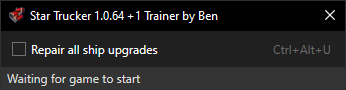

🏃 Trainers
===

<a id="requirements"></a>
## Requirements
- [.NET Framework 4.7.2 runtime](https://dotnet.microsoft.com/download/dotnet-framework) or later (included in Windows 10 version 1803 and later)

## Arguments
- `--enable-cheat "CHEAT NAME"`
    - Optional, can be passed 0 or more times.
    - Automatically enables the given cheat on trainer startup, instead of you having to manually click the checkbox.
    - `CHEAT NAME` is the name of the cheat as it appears in the trainer UI, such as `No speed limit`. Case-insensitive. Remember to use quotation marks if it contains spaces.
    - Useful if you always want to play a game with a given cheat active, and you want to launch the game with a batch file that both starts the game and starts the trainer with this cheat enabled.
        ```bat
        @echo off
        start Dakar2Game.exe
        start DakarDesertRallyTrainer.exe --enable-cheat "No speed limit" --enable-cheat "No damage"
        ```

## Games
<!-- MarkdownTOC autolink="true" bracket="round" autoanchor="false" levels="3" style="unordered" -->

- [Dakar 18](#dakar-18)
- [Dakar Desert Rally](#dakar-desert-rally)
- [Star Trucker](#star-trucker)
- [Superhot: Mind Control Delete](#superhot-mind-control-delete)

<!-- /MarkdownTOC -->

### Dakar 18


[💾 Download](https://github.com/Aldaviva/Trainers/releases/latest/download/Dakar18Trainer.exe)

- No speed limit
    - All speed limit penalties and warnings are removed in all difficulty levels.
    - You are still automatically limited to 30 km/h in passage control auto-driving zones.

#### Supported game versions

- **v.13**, released in March 2019, which contains Desafio Ruta 40 Rally and Inca Rally

### Dakar Desert Rally


[💾 Download](https://github.com/Aldaviva/Trainers/releases/latest/download/DakarDesertRallyTrainer.exe)

- No speed limit
    - All speed limit penalties, and red and yellow speed warnings, are removed in all difficulty levels.
    - The gray speed limit warning is still visible in Simulation Mode and areas with speed limits, like villages and passage control, but it's not enforced.
    - The co-driver doesn't scold you for going fast.
    - Hilariously, you are *not* limited to 30 km/h in passage control auto-driving zones, unlike in [Dakar 18](#dakar-18). Therefore, you may want to slow down and disable this cheat before entering passage control, in order to avoid [missing the exit and getting stuck in auto-drive for the rest of the stage](https://twitter.com/Aldaviva/status/1602037249650081793).
- No damage
    - Vehicles don't take damage to the Mechanics, Wheels, or Suspension parts categories during stages.
    - They still take Body damage, including dirt and bent body panels, but these don't affect the vehicle's performance.
    - The co-driver will still exclaim when you would have taken damage.
    - Enable this cheat before starting a stage. If you enable it during a stage, it won't take effect until the next stage.
    - After disabling this cheat, restart the game for it to take effect.
    - This cheat is little unreliable and may not work all the time. If you can't get it to work, try restarting the game while this cheat is still enabled in the trainer.

#### Supported game versions

|Version|Distributor|Release date|Build|Changes|
|-|-|-|-:|-|
|2.3.420|Epic Games|2024-03||Fixed Logitech G920 wheel crash|
|[2.3.0](https://store.steampowered.com/news/app/1839940/view/6923793758884093997)|Steam|2024-03-18|13722644|Fixed Logitech G920 wheel crash|
|[2.3.0](https://store.steampowered.com/news/app/1839940/view/4027975938511238388)|Steam|2024-02-12|13351034|[USA Tour](https://store.steampowered.com/news/app/1839940/view/6715496576543059671) plus fixes for crash and bike audio|
|[1.9.0](https://store.steampowered.com/news/app/1839940/view/6466647949833257321)|Steam|2023-04-13|10880370|Classic Vehicle Pack #1|
|[1.7.0](https://store.steampowered.com/news/app/1839940/view/3654145459652107245)|Steam|2023-02-28|10618159|SnowRunner Truck Pack|
|[1.6.0](https://store.steampowered.com/news/app/1839940/view/3644009189553404411)|Steam|2023-01-20|10366290|Free Roam|
|[1.5.0](https://store.steampowered.com/news/app/1839940/view/5379014706391343864)|Steam|2022-11-15|9902125|7 new events in Extended Saudi Arabia Map|

### Star Trucker



[💾 Download](https://github.com/Aldaviva/Trainers/releases/latest/download/StarTruckerTrainer.exe)

- Repair all ship upgrades
    - Affects all 10 ship systems
        1. Turbopump System (acceleration)
        1. Combusion Chambers (speed)
        1. Nozzle Coolers (coolant)
        1. Engine Control Unit (fuel economy)
        1. Reinforced Plating (armor)
        1. Thermal Insulation (heat and cold resistance)
        1. Anti-Capacitive Shielding (shock resistance)
        1. Maglock Dampener (cargo damage resistance)
        1. Suit Station (suit charging)
        1. Sensor Tuning (scanner range)
    - Keeps you from having to continually waste your time and money trekking to Upgrade Shops to repair degraded systems every few minutes
    - Does not repair other parts of the ship, such as the hull, or items like Universal Control Circuits

#### Supported game versions

|Version|Distributor|Release date|Build|Changes|
|-|-|-|-:|-|
|[1.0.64](https://store.steampowered.com/news/app/2380050/view/497197576207993354)|Steam|2025-06-12|18840658|[Perks, Plates, and Parking](https://store.steampowered.com/news/app/2380050/view/497197576207993320)|

### Superhot: Mind Control Delete


[💾 Download](https://github.com/Aldaviva/Trainers/releases/latest/download/SuperhotMindControlDeleteTrainer.exe)

- Infinite health

#### Supported game versions

- **1.0.0**, which has file version `2018.4.5.14584`

## Acknowledgments

- [Dewlapped](https://github.com/Dewlapped) for help updating the Dakar Desert Rally trainer to support the 2024-03-18 Steam release of the game